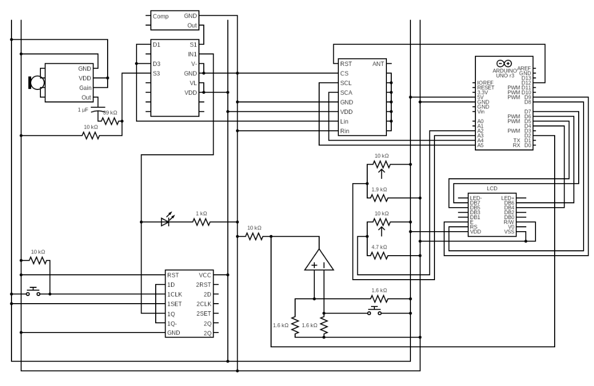
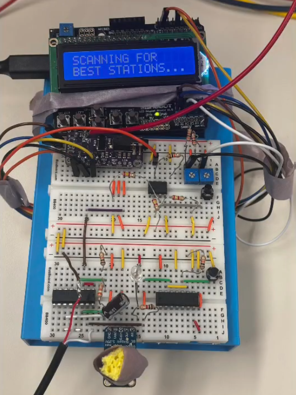

# 📻 Arduino FM Radio Transmitter

> **PHYS 124 Final Project | UC San Diego, March 2026**  
> Built by **Jacob Ortiz** & **Mathias Pretet**

A fully functional, digitally controlled FM radio transmitter built around the SI4713 FM transmitter IC and an Arduino Uno. The system scans the FM band for the quietest available channel, allows real-time frequency tuning via dual potentiometers, and broadcasts live audio from either a microphone or a laptop, switchable with a hardware flip-flop circuit button.




---

## Features

- **Automatic FM Band Scan**: On power-up, the SI4713 temporarily acts as a receiver and measures noise across 88–108 MHz in 100 kHz steps. The two quietest channels are displayed on the LCD so the user can pick the cleanest frequency before transmitting.
- **Dual Audio Source Selection**: A 74HC74 dual D flip-flop drives a DG403 analog switch to route either the microphone or a laptop (3.5mm jack) to the transmitter. A single button press toggles the source, an LED indicates laptop mode.
- **Real-Time Frequency Tuning**: Two potentiometers independently control the integer MHz (88–107) and decimal MHz (0.00–1.00) portions of the transmission frequency. A 16x2 LCD shows both the frequency being dialed (TUNE row) and the one currently transmitting (SEND row). The new frequency is only committed on a deliberate button press.
- **Hardware Interrupt + Comparator Debounce**: The frequency-set button is conditioned through an LM311 voltage comparator, producing a clean falling edge that triggers Arduino INT0. Software debouncing (100 ms timestamp comparison) inside the ISR eliminates bounce without needing any additional hardware.
- **Maximum Transmit Power**: The SI4713 is configured at 115 dBuV, the maximum allowed output level, for strong, room-filling range.
- **Microphone Conditioning**: The MAX9814 electret mic amplifier is attenuated with a resistor voltage divider (to ~1/5 amplitude) and AC-coupled through a 0.1 µF capacitor to avoid overdriving the SI4713 input. A sponge cap on a boba straw reduces breath noise.
- **Serial Diagnostics**: Every 2 seconds the system prints ASQ (audio signal quality), input level (dBFS), transmit power (dBuV), and antenna capacitance to the Serial monitor.

---

## Hardware

| Component | Part | Notes |
|-----------|------|-------|
| Microcontroller | Arduino Uno | Central controller |
| FM Transmitter IC | SI4713 clone breakout | I2C address **0x11** (not 0x63) |
| LCD Display | 16x2 LCD (4-bit mode) | Direct-wired, no I2C backpack |
| Microphone | MAX9814 electret amplifier module | AGC disabled via GAIN pin → VDD |
| Audio Switch | DG403 analog switch | Controlled by flip-flop Q output |
| Source Toggle | 74HC74 dual D flip-flop | Q̄ fed back to D for toggle behavior |
| Frequency Button | LM311 voltage comparator | Conditions button → clean falling edge for INT0 |
| Frequency Tuning | 2x potentiometers | A3 = integer MHz, A2 = decimal MHz |
| Receiver | Retekess V115 FM radio | Connected to a table amplifier |
| Antenna | ~70 cm wire | Quarter-wave approximation for FM band |

### SI4713 Breakout Pin Connections

| SI4713 Pin | Connected To | Purpose |
|-----------|-------------|---------|
| Vin | Arduino 5V | Power |
| GND | Common GND | Ground |
| SDA | Arduino A4 | I2C data |
| SCL | Arduino A5 | I2C clock |
| RST | Arduino D12 | Hardware reset (100ms LOW → HIGH pulse) |
| CS | GND | Selects 2-wire I2C mode |
| Lin | DG403 output | Left audio input |
| Rin | GND | Right channel (unused, tied to ground for mono) |
| ANT | ~70 cm wire | FM antenna |
| GP1, GP2, 3vo | Unconnected | Not used |

---

## Wiring Overview

```
Arduino Uno
├── A2  → Potentiometer (decimal MHz)
├── A3  → Potentiometer (integer MHz)
├── A4  → SI4713 SDA
├── A5  → SI4713 SCL
├── D2  → LM311 output (frequency-set interrupt, INT0)
├── D4–D9 → 16×2 LCD (RS=8, EN=9, D4–D7=4–7)
├── D12 → SI4713 RST

74HC74 Flip-Flop
├── CLK ← Source-select pushbutton (5V)
├── D   ← Q̄ (self-toggling)
├── Q   → DG403 control input + LED indicator
└── Q̄   → D (feedback for toggle)

DG403 Analog Switch
├── IN_A ← MAX9814 microphone output (attenuated + AC-coupled)
├── IN_B ← Laptop audio (3.5mm jack)
├── SEL  ← 74HC74 Q output
└── OUT  → SI4713 Lin pin

MAX9814 Microphone
├── VDD  → 5V
├── GND  → GND
├── GAIN → VDD (select 40dB minimum gain)
└── OUT  → voltage divider attenuator → DG403 IN_A
```

---

## Software

All SI4713 control is done via raw I2C commands, no Adafruit library is used. This was necessary because the clone board at address `0x11` requires a manual `POWER_UP` command (`0x01, 0x12, 0x50`) before any other commands will be accepted, which the Adafruit library does not send correctly for this variant.

### Key Functions

| Function | Description |
|---------|-------------|
| `sendCommand(cmd, ...)` | Sends a raw I2C command to the SI4713 with up to 5 argument bytes |
| `tuneTo(freq)` | Tunes the transmitter using `TX_TUNE_FREQ` (0x30); freq in units of 10 kHz |
| `readASQ()` | Reads Audio Signal Quality via `TX_ASQ_STATUS` (0x34); prints overmod/undermod flags and input dBFS level |
| `readTuneStatus()` | Reads current frequency, transmit power (dBuV), and antenna capacitance via `TX_TUNE_STATUS` (0x33) |
| `tune()` (ISR) | Triggered on INT0 falling edge; debounces in software and sets `sendFreq` flag |

### Startup Sequence

1. LCD shows `SCANNING FOR BEST STATIONS...`
2. RST pin held LOW for 100ms, then HIGH guarantees clean chip initialization
3. Raw `POWER_UP` command sent over I2C
4. Transmit power set to 115 dBuV
5. Full FM band scan (88.0–108.0 MHz, 100 kHz steps) using insertion sort to track top 3 quietest channels
6. Top 2 results displayed on LCD with their noise floor values
7. Potentiometers read → initial frequency computed → `TX_TUNE_FREQ` sent
8. LCD switches to normal TUNE/SEND layout; system enters main loop

### Main Loop

- Continuously reads potentiometers and updates TUNE row on LCD
- When ISR sets `sendFreq = 1`: converts pot reading → 10 kHz units → sends `TX_TUNE_FREQ`, shows `NEW FREQ SET` confirmation on LCD
- Every 2 seconds: prints ASQ and tune status to Serial for diagnostics

---

## ⚠️ Important Notes for Clone SI4713 Boards

This project uses a **clone SI4713 breakout**, **not** the genuine Adafruit FM Transmitter Breakout. There are critical differences:

1. **I2C Address**: Clone boards use `0x11`. The genuine Adafruit board uses `0x63`.
2. **Power-Up Sequence**: The clone requires a raw `POWER_UP` I2C command (`0x01, 0x12, 0x50`) to be sent *before* any library calls. The Adafruit library's `begin()` does not handle this correctly for clone chips.
3. **RST Pin**: Must be wired to **D12** with an explicit 100ms LOW/HIGH pulse in `setup()`. Without this, the chip may not initialize reliably across power cycles.
4. **No Library**: Given the above, all commands are sent as raw I2C writes using `Wire.h` directly.

---

## Build Challenges & Solutions

| Challenge | Solution |
|-----------|----------|
| Clone SI4713 wouldn't initialize with Adafruit library | Diagnosed via raw I2C status register reads; bypassed library entirely with raw `POWER_UP` command sequence |
| FM receiver module (TEA series) too unreliable for RX side | Pivoted to a commercial Retekess V115 receiver; focused on perfecting the TX side |
| MAX9814 mic output too strong → audio distortion | Added resistor voltage divider attenuator (~5× reduction) + 0.1 µF AC coupling cap; set GAIN pin to VDD for minimum on-chip gain |
| SI4713 can't mix two audio inputs | Added 74HC74 flip-flop + DG403 analog switch to cleanly route one source at a time |
| Button bounce causing false frequency updates | Conditioned button through LM311 comparator for clean digital edge; software debounce in ISR (100ms threshold) |
| Breath noise on microphone | Built housing from boba straw + sponge pop filter |

---

## Repository Structure

```
fm-transmitter/
├── final_fixed_raw_commented.ino   # Main Arduino sketch (fully commented)
└── README.md
```

---

## Getting Started

### Prerequisites

- Arduino IDE
- Libraries: `Wire.h` (built-in), `LiquidCrystal.h` (built-in)
- No additional library installs required

### Upload

1. Clone this repository
2. Open `final_fixed_raw_commented.ino` in Arduino IDE
3. Select **Arduino Uno** as the board and the correct COM port
4. Upload

### First Run

1. Power on: the LCD will show `SCANNING FOR BEST STATIONS...` while it sweeps the FM band
2. After ~30 seconds, the two quietest frequencies are displayed with their noise values
3. Tune your FM radio to one of those frequencies
4. Use the potentiometers to select your desired broadcast frequency; press the frequency button to commit
5. Speak into the mic, or press the source button to switch to laptop audio

---

## Contributors

- **Jacob Ortiz**
- **Mathias Pretet**

---

## License

This project was built for academic purposes as a final project for Kam Arnold's PHYS 124 at UC San Diego. Feel free to use or adapt for your own learning.